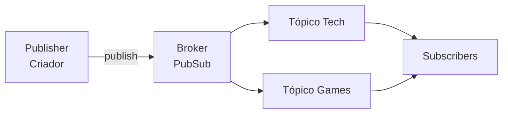

# Pub/Sub em streaming e redes sociais

Este projeto apresenta uma implementação simples do padrão Publish/Subscribe (Pub/Sub) aplicada a uma plataforma fictícia de streaming e redes sociais.

## Identificação

- Disciplina: Sistemas Computacionais Distribuídos e Computação em Nuvem
- Professora: Ana Paula
- Integrantes: Marcos Paulo, Marcos Vinicius e Marcos

## Cenário

Na plataforma, criadores publicam vídeos, posts e transmissões em categorias como `Tech` e `Games`. Cada usuário escolhe os tópicos que deseja acompanhar. Quando um conteúdo novo é publicado, somente os usuários inscritos naquele tópico recebem a notificação.

O criador envia o conteúdo ao broker sem precisar conhecer os usuários. O broker controla as inscrições e distribui cada mensagem para os assinantes corretos. Se um usuário cancelar a inscrição, ele deixa de receber as próximas publicações daquele tópico.

## Arquitetura



| Componente | Uso no projeto |
|---|---|
| Publisher | Classe `CriadorConteudo` |
| Broker | Classe `PubSub` |
| Tópicos | `Tech` e `Games` |
| Subscribers | Objetos da classe `Usuario` |

A classe `PubSub` possui os três métodos principais do padrão:

- `subscribe(topico, assinante)` inscreve um usuário em um tópico;
- `publish(topico, mensagem)` entrega a mensagem aos assinantes ativos;
- `unsubscribe(topico, assinante)` cancela uma inscrição.

## Arquivos do projeto

```text
.
├── main.py          # executa a simulação
├── modelos.py       # contém o Publisher e o Subscriber
├── pubsub.py        # contém o broker Pub/Sub
├── test_pubsub.py   # testes automatizados
└── README.md
```

## Como executar

O projeto requer Python 3.10 ou superior e não utiliza bibliotecas externas.

Abra o terminal na pasta do projeto e execute:

```bash
python main.py
```

Se o sistema usar o comando `python3`, execute:

```bash
python3 main.py
```

Durante a simulação, os usuários assinam os tópicos `Tech` e `Games`, os criadores publicam novos conteúdos e o broker envia as notificações. Depois, Marcos Vinicius cancela sua inscrição em `Games`. A publicação seguinte é entregue apenas a Marcos, que continua inscrito nesse tópico.

## Testes

Para executar os testes automatizados:

```bash
python -m unittest -v
```

Os testes verificam a inscrição de usuários, o envio de mensagens, a separação entre tópicos, o cancelamento de inscrições, a prevenção de duplicidades e a validação de tópicos vazios.

## Observação

Esta implementação mantém os dados em memória e foi criada para demonstrar o funcionamento do padrão Pub/Sub. Em um sistema distribuído real, o broker poderia ser implementado com Apache Kafka, RabbitMQ ou Redis Pub/Sub.
