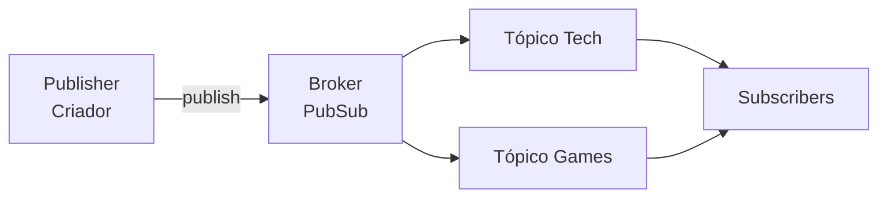

# Pub/Sub — Streaming e Redes Sociais

Projeto acadêmico que demonstra o padrão **Publish/Subscribe (Pub/Sub)** em uma plataforma fictícia de streaming e redes sociais.

## Identificação

- **Disciplina:** Sistemas Computacionais Distribuídos e Computação em Nuvem
- **Professora:** Ana Paula
- **Integrantes:** Marcos Paulo, Marcos Vinicius e Marcos

## Cenário escolhido

Criadores de conteúdo publicam vídeos, posts ou transmissões em categorias como `Tech` e `Games`. Os usuários assinam somente os assuntos que desejam acompanhar e recebem automaticamente as novas publicações. Ao cancelar uma inscrição, o usuário deixa de receber os conteúdos daquele tópico.

O criador não conhece os usuários que receberão a mensagem. Toda a comunicação é intermediada pelo broker `PubSub`, reduzindo o acoplamento entre os componentes.

## Arquitetura



| Componente | Implementação no projeto |
|---|---|
| Publisher | Classe `CriadorConteudo` |
| Broker | Classe `PubSub` |
| Topics | `Tech` e `Games` |
| Subscribers | Objetos da classe `Usuario` |

O broker implementa os três métodos exigidos:

- `subscribe(topico, assinante)`: registra um assinante;
- `publish(topico, mensagem)`: envia a mensagem aos assinantes ativos;
- `unsubscribe(topico, assinante)`: remove a inscrição.

## Estrutura dos arquivos

```text
.
├── main.py                    # simulação completa
├── modelos.py                 # Publisher e Subscriber
├── pubsub.py                  # Broker Pub/Sub
├── test_pubsub.py             # testes automatizados
├── ROTEIRO_APRESENTACAO.md    # divisão sugerida da apresentação
└── README.md
```

## Como executar

### Requisito

- Python 3.10 ou superior.

Não há bibliotecas externas para instalar.

### Demonstração

No terminal, dentro da pasta do projeto, execute:

```bash
python main.py
```

Em alguns sistemas, o comando pode ser:

```bash
python3 main.py
```

A execução demonstra esta sequência:

1. usuários assinam os tópicos `Tech` e `Games`;
2. criadores publicam conteúdos;
3. somente os inscritos no tópico recebem cada conteúdo;
4. Marcos Vinicius cancela a inscrição em `Games`;
5. uma nova publicação é feita em `Games`;
6. Marcos Vinicius não recebe mais a mensagem desse tópico.

### Testes automatizados

```bash
python -m unittest -v
```

Os testes verificam inscrição, publicação, separação entre tópicos, cancelamento, duplicidade e validação de tópico vazio.

## Conceitos demonstrados

- comunicação orientada a eventos;
- desacoplamento entre publishers e subscribers;
- distribuição de mensagens por tópicos;
- inscrição e desinscrição dinâmica;
- um evento entregue a múltiplos destinatários.

> Esta é uma simulação didática em memória. Em um ambiente distribuído real, o broker poderia ser substituído por tecnologias como Apache Kafka, RabbitMQ ou Redis Pub/Sub.
